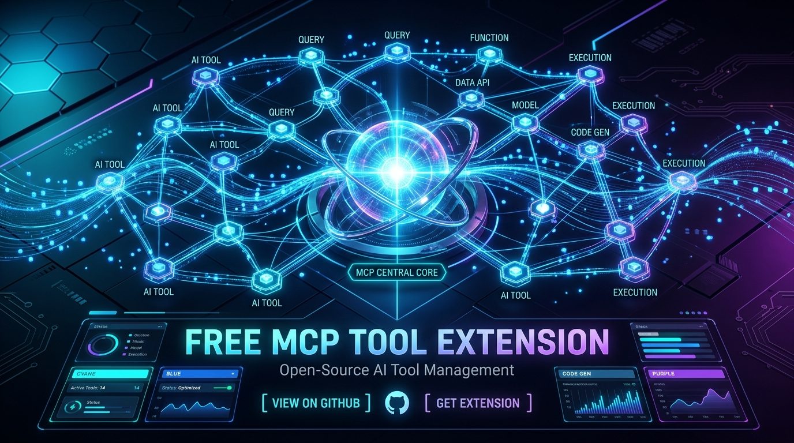
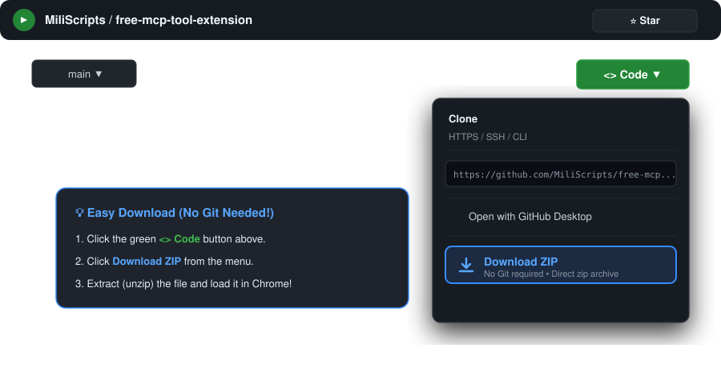
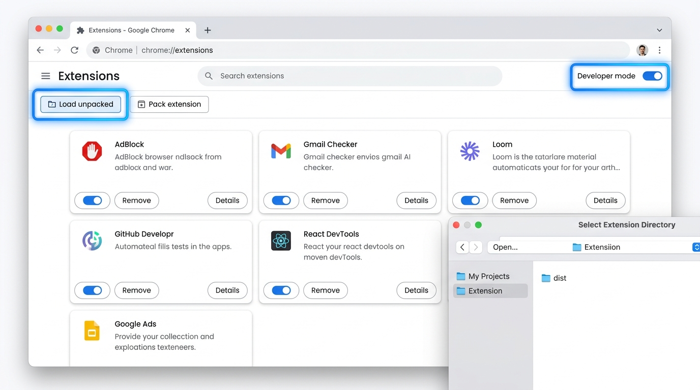
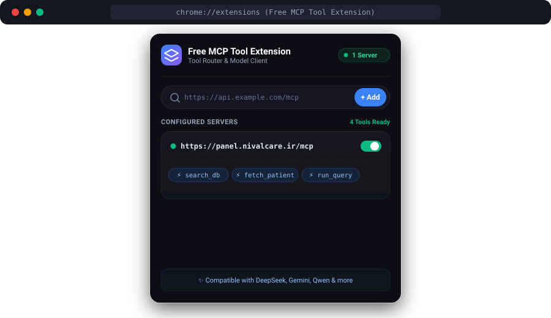
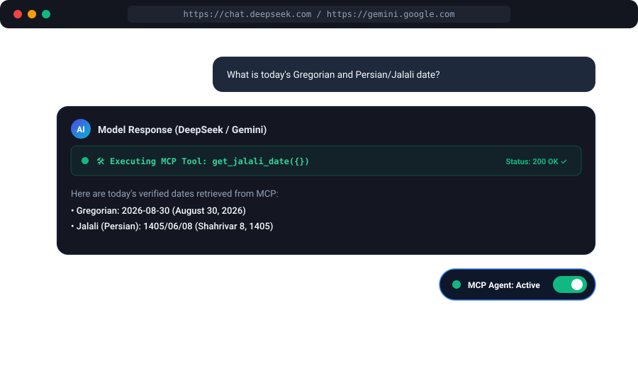

# Free MCP Tool Extension 🚀

<p align="center">
  
</p>

<p align="center">
  
</p>

<p align="center">
  <a href="#-english-guide"><b>English Guide</b></a> •
  <a href="#-developer-guide-building-custom-mcp-servers"><b>Developer Guide (Build MCP)</b></a> •
  <a href="#-راهنمای-فارسی-persian-guide"><b>راهنمای فارسی (Persian)</b></a>
</p>

---

## 🌐 English Guide

A free, open-source, universal Model Context Protocol (MCP) tool runner and autonomous agent router for web AI chats. Seamlessly connect local or remote MCP servers and execute tools directly inside web LLMs like DeepSeek, Google Gemini, Qwen, DuckDuckGo AI, Mistral, and Z.ai.

### ✨ Key Features

- 🔌 **Universal MCP Compatibility**: Connects to standard MCP JSON-RPC endpoints, custom REST tool lists, and remote MCP routers without extra backend setup.
- 🌐 **Multi-Platform Web LLM Support**:
  - DeepSeek (`deepseek.com`)
  - Google Gemini (`gemini.google.com`)
  - Qwen (`qwen.ai`)
  - DuckDuckGo AI (`duck.ai`)
  - Mistral AI (`mistral.ai`)
  - Z.ai (`z.ai`)
- 🤖 **Autonomous Multi-Step Tool Execution Loop**:
  - Injects dynamic schema prompts and tool capabilities.
  - Automatically intercepts AI tool execution calls.
  - Executes remote tools via background service workers with full CORS handling.
  - Feeds results back into the conversation for continuous execution until task completion.
- 🎛️ **Modern Popup Dashboard**:
  - Live server connection health monitoring (online / error indicators).
  - Enable / disable individual servers or specific tools on the fly.
  - Inspect server tool catalogs with schema arguments and parameter details.
- ⚡ **Manifest V3 Compliant**: Fast, lightweight, and secure.

---

### 📥 Downloading the Extension

#### Option A: Download as ZIP (No Git Required! ⚡)
If you don't have Git installed, you can easily download the extension as a `.zip` archive:
1. Click the green **`<> Code`** button at the top of this GitHub repository page.
2. Click **Download ZIP**.
3. Extract (unzip) the downloaded file to a folder on your computer.

<p align="center">
  
</p>

#### Option B: Clone via Git
```bash
git clone https://github.com/MiliScripts/free-mcp-tool-extension.git
```

---

### 📖 Step-by-Step Installation & Usage Guide

#### Step 1: Install Extension in Developer Mode
1. Open Chrome (or any Chromium browser like Brave, Edge, Arc) and go to `chrome://extensions/`.
2. Enable **Developer mode** toggle in the top-right corner.
3. Click **Load unpacked** and select the unzipped or cloned extension folder (`free-mcp-tool-extension`).

<p align="center">
  
</p>

#### Step 2: Configure Your MCP Servers
1. Click the **Free MCP Tool Extension** icon in your browser extension toolbar.
2. Enter your MCP Server URL and click **+ Add**:
   - 📅 **Free Public Date MCP**:
     `https://mcpdate.kamyaarsr.workers.dev/mcp` *(Provides `get_date`, `get_jalali_date`)*
   - 📱 **Free Personal Telegram Agent MCP (@saveitmcpBot)**:
     1. Start the bot on Telegram: **[@saveitmcpBot](https://t.me/saveitmcpBot)**
     2. Send `/start` to receive your private MCP URL:
        `https://saveitmcp.miladjobs22.workers.dev/YOUR_SECRET_KEY/mcp`
     3. Add this URL into the extension!
     4. Now in any AI web chat, you can ask: *"Send this summary/file/post to my Telegram!"* and the AI will autonomously deliver messages, rich formatted text, photos, files, and checklists directly to your Telegram chat.
3. The extension automatically registers all exposed tools!

<p align="center">
  
</p>

#### Step 3: Run AI Prompts with Autonomous Tool Calling
1. Open DeepSeek, Gemini, Qwen, or any supported AI chat.
2. Ensure the MCP Agent status badge is **Active / ON**.
3. Ask the AI model questions that require external data or API actions — tools are automatically invoked, executed, and fed back to the model!

<p align="center">
  
</p>

---

## 🛠️ Developer Guide: Building Custom MCP Servers

If you want to build your own custom MCP server (using Cloudflare Workers, Node.js/Express, Python FastAPI, etc.), here is the exact request/response specification handled by this extension.

### 1. Tool Discovery (`tools/list`)
When you add or refresh a server, the extension sends a `POST` request with JSON-RPC:

**Request Payload:**
```json
{
  "jsonrpc": "2.0",
  "id": 1,
  "method": "tools/list"
}
```

**Expected Response Formats (Supports Standard & Simplified):**

*Standard MCP JSON-RPC Format (Recommended):*
```json
{
  "jsonrpc": "2.0",
  "id": 1,
  "result": {
    "tools": [
      {
        "name": "get_weather",
        "description": "Get current weather for a city",
        "inputSchema": {
          "type": "object",
          "properties": {
            "city": { "type": "string", "description": "City name" }
          },
          "required": ["city"]
        }
      }
    ]
  }
}
```

*Direct REST / Simplified Format:*
```json
{
  "tools": [
    {
      "name": "calculate_discount",
      "description": "Calculate discount percentage",
      "inputSchema": {
        "type": "object",
        "properties": {
          "price": { "type": "number" }
        }
      }
    }
  ]
}
```

---

### 2. Tool Execution (`tools/call`)
When the AI outputs a `[[TOOL_CALL]]` during chat, the extension sends a `POST` request to execute it:

**Request Payload:**
```json
{
  "jsonrpc": "2.0",
  "id": 1788088860664,
  "method": "tools/call",
  "params": {
    "name": "get_weather",
    "arguments": {
      "city": "Tehran"
    }
  }
}
```

**Expected Response Format:**
```json
{
  "jsonrpc": "2.0",
  "id": 1788088860664,
  "result": {
    "content": [
      {
        "type": "text",
        "text": "The weather in Tehran is 24°C and Sunny."
      }
    ]
  }
}
```

---

### 3. Quick Implementation Example (Cloudflare Worker / Node.js)

```javascript
export default {
  async fetch(request) {
    // Handle CORS headers
    const corsHeaders = {
      "Access-Control-Allow-Origin": "*",
      "Access-Control-Allow-Methods": "POST, GET, OPTIONS",
      "Access-Control-Allow-Headers": "Content-Type"
    };

    if (request.method === "OPTIONS") {
      return new Response(null, { headers: corsHeaders });
    }

    const body = await request.json().catch(() => ({}));

    // 1. Tool Discovery
    if (body.method === "tools/list") {
      return Response.json({
        jsonrpc: "2.0",
        id: body.id || 1,
        result: {
          tools: [
            {
              name: "get_date",
              description: "Returns the current UTC date",
              inputSchema: { type: "object", properties: {} }
            }
          ]
        }
      }, { headers: corsHeaders });
    }

    // 2. Tool Execution
    if (body.method === "tools/call") {
      const { name, arguments: args } = body.params || {};

      if (name === "get_date") {
        return Response.json({
          jsonrpc: "2.0",
          id: body.id,
          result: {
            content: [{ type: "text", text: new Date().toISOString() }]
          }
        }, { headers: corsHeaders });
      }
    }

    return Response.json({ error: "Method not found" }, { status: 404, headers: corsHeaders });
  }
};
```

---

### 📁 Repository Structure

```
free-mcp-tool-extension/
├── assets/
│   ├── banner.jpg                  # GitHub repository banner
│   ├── step_download_zip.svg       # Download ZIP illustration
│   ├── step1_load_extension.jpg    # Installation screenshot
│   ├── step2_setup_server.svg      # Server popup UI diagram
│   ├── step3_chat_execution.svg    # Execution loop diagram
│   └── icons/                      # Extension icons (16, 32, 48, 128px)
├── manifest.json                   # Chrome extension Manifest V3 configuration
├── popup.html                      # Extension popup UI (modern dark theme)
├── popup.js                        # Server management, live tool registry, and toggles
├── content.js                      # Injected runtime: chat detection, tool calling loop, and UI controls
├── background.js                   # Background service worker for MCP fetch requests & CORS bypass
├── .gitignore                      # Git ignore file
└── README.md                       # Documentation
```

---

### ⭐ Support & Feedback

If you find this project useful, please consider giving it a **Star ⭐** on GitHub!

💬 **Feedback & Suggestions:**
Feel free to reach out and send your feedback directly on Telegram: **[@kiorcode](https://t.me/kiorcode)**

---

<br />

## 🇮🇷 راهنمای فارسی (Persian Guide)

اکستنشن **Free MCP Tool Extension** یک افزونه رایگان، متن‌باز و همه‌منظوره برای اتصال سرورهای پروتکل MCP (Model Context Protocol) به هوش‌های مصنوعی تحت وب نظیر DeepSeek، گوگل جمی‌نای (Gemini)، Qwen، Duck.ai، Mistral و Z.ai است. با استفاده از این افزونه، مدل‌های چت وب قادر به اجرای خودکار ابزارها (Tool Calling) و دسترسی به APIهای دلخواه شما خواهند بود.

---

### ✨ قابلیت‌های اصلی

- 🔌 **پشتیبانی سراسری از پروتکل MCP**: قابلیت اتصال به سرورهای استاندارد MCP JSON-RPC و REST endpoints بدون نیاز به واسط‌های پیچیده.
- 🌐 **پشتیبانی از پلتفرم‌های متنوع هوش مصنوعی**:
  - دیپ‌سیک (`deepseek.com`)
  - گوگل جمی‌نای (`gemini.google.com`)
  - کون (`qwen.ai`)
  - داک‌داک‌گو چت (`duck.ai`)
  - میسترال (`mistral.ai`)
  - زت‌آی (`z.ai`)
- 🤖 **حلقه اجرای خودکار چندمرحله‌ای (Autonomous Loop)**:
  - تزریق خودکار ساختار و توضیحات ابزارها به پرامپت سیستم هوش مصنوعی.
  - رهگیری و استخراج خودکار درخواست‌های اجرای تولز از پاسخ مدل.
  - فراخوانی ابزارها از طریق Background Service Worker با رفع کامل خطاهای CORS.
  - بازگرداندن خودکار نتایج ابزار به چت جهت تکمیل مراحل بعدی تا رسیدن به پاسخ نهایی.
- 🎛️ **پنل مدیریت مدرن و پیشرفته**:
  - بررسی زنده وضعیت آنلاین یا آفلاین بودن سرورها.
  - فعال یا غیرفعال کردن تک‌تک سرورها یا ابزارهای خاص.
  - مشاهده لیست پارامترها و مشخصات ابزارهای رجیستر شده.
- ⚡ **سازگار با Manifest V3**: سبک، سریع و کاملاً امن.

---

### 📥 دانلود افزونه

#### روش اول: دانلود مستقیم فایل ZIP (بدون نیاز به گیت! ⚡)
اگر نرم‌افزار Git روی سیستم شما نصب نیست:
1. در بالای صفحه همین ریپازیتوری در گیت‌هاب، روی دکمه سبز رنگ **`Code <>`** کلیک کنید.
2. گزینه **Download ZIP** را انتخاب کنید.
3. فایل دانلود شده را با راست‌کلیک و گزینه **Extract All** (یا باز کردن فایل زیپ) در یک پوشه استخراج نمایید.

<p align="center">
  
</p>

#### روش دوم: کلون از طریق گیت
```bash
git clone https://github.com/MiliScripts/free-mcp-tool-extension.git
```

---

### 🚀 آموزش گام‌به‌گام نصب و راه‌اندازی

#### گام ۱: نصب افزونه در مرورگر کروم
1. مرورگر کروم (یا هر مرورگر مبتنی بر Chromium مانند Brave، Edge، Arc) را باز کرده و به آدرس `chrome://extensions/` بروید.
2. گزینه **Developer mode** (حالت توسعه‌دهنده) را در گوشه سمت راست بالای صفحه فعال کنید.
3. روی دکمه **Load unpacked** کلیک کرده و پوشه اکسترکت شده پروژه (`free-mcp-tool-extension`) را انتخاب نمایید.

<p align="center">
  
</p>

#### گام ۲: اضافه کردن سرور MCP
1. روی آیکون **Free MCP Tool Extension** در نوار ابزار بالای مرورگر کلیک کنید.
2. آدرس سرور MCP خود را وارد کرده و دکمه **Add** را بزنید:
   - 📅 **سرور عمومی تقویم جلالی/میلادی**:
     `https://mcpdate.kamyaarsr.workers.dev/mcp` *(شامل ابزارهای `get_date` و `get_jalali_date`)*
   - 📱 **سرور رایگان ارسال به تلگرام با ربات (@saveitmcpBot)**:
     1. در تلگرام ربات **[@saveitmcpBot](https://t.me/saveitmcpBot)** را استارت (`/start`) کنید.
     2. ربات یک لینک اختصاصی MCP برای شما ارسال می‌کند:
        `https://saveitmcp.miladjobs22.workers.dev/YOUR_SECRET_KEY/mcp`
     3. این آدرس را داخل اکستنشن وارد کنید.
     4. حالا در هر چت هوش مصنوعی (DeepSeek، Gemini و...) می‌توانید بگویید: *«این خلاصه متن یا کد را به تلگرامم بفرست»* تا هوش مصنوعی به شکل خودکار پیام، فایل، عکس، چک‌لیست و متون فرمت‌شده را به تلگرام شما ارسال کند!
3. اکستنشن به صورت خودکار ابزارها را شناسایی و لیست می‌کند.

<p align="center">
  
</p>

#### گام ۳: استفاده در محیط چت هوش مصنوعی
1. وارد یکی از پلتفرم‌های چت هوش مصنوعی مثل DeepSeek یا Gemini شوید.
2. از فعال بودن دکمه وضعیت اکستنشن در صفحه مطمئن شوید.
3. اکنون پرامپت‌های مورد نظر خود را بپرسید؛ مدل به شکل هوشمند ابزارهای متصل شده را فراخوانی و اجرا خواهد کرد.

<p align="center">
  
</p>

---

### 🛠️ راهنمای توسعه‌دهندگان (ساخت سرور اختصاصی MCP)

اگر می‌خواهید سرور MCP اختصاصی خود را (با Cloudflare Workers، پایتون یا Node.js) پیاده‌سازی کنید:

۱. **متد دریافت لیست ابزارها (`tools/list`)**:
اکستنشن به آدرس سرور شما درخواست `POST` با بدنه زیر می‌فرستد:
```json
{ "jsonrpc": "2.0", "id": 1, "method": "tools/list" }
```
پاسخ سرور باید ساختار ابزارها را در `result.tools` بازگرداند:
```json
{
  "jsonrpc": "2.0",
  "id": 1,
  "result": {
    "tools": [
      {
        "name": "my_tool",
        "description": "توضیحات ابزار",
        "inputSchema": { "type": "object", "properties": {} }
      }
    ]
  }
}
```

۲. **متد اجرای ابزار (`tools/call`)**:
هنگامی که مدل در چت دستور فراخوانی ابزار را صادر کند:
```json
{
  "jsonrpc": "2.0",
  "id": 1788088860664,
  "method": "tools/call",
  "params": {
    "name": "my_tool",
    "arguments": { "param1": "value" }
  }
}
```
پاسخ نتیجه به شکل زیر خواهد بود:
```json
{
  "jsonrpc": "2.0",
  "id": 1788088860664,
  "result": {
    "content": [
      { "type": "text", "text": "نتیجه اجرای ابزار" }
    ]
  }
}
```

---

### ⭐ حمایت و بازخورد

اگر این پروژه برای شما کاربردی بود، لطفاً با دادن یک **ستاره ⭐ (Star)** در گیت‌هاب از آن حمایت کنید!

💬 **ارتباط و ارسال نظرات:**
جهت ارسال بازخوردها، گزارش باگ یا پیشنهادات می‌توانید در تلگرام با آیدی **[@kiorcode](https://t.me/kiorcode)** در ارتباط باشید.
